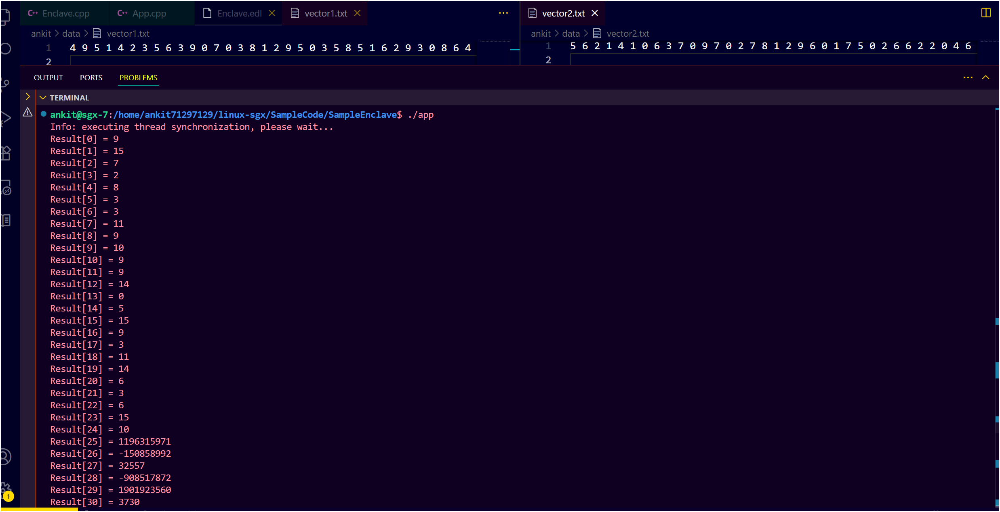

# SGX Vector Upload Backend

This Java application generates two random integer vectors and uploads them to an **Azure Virtual Machine (VM)** via SSH. These vectors are then used by a **secure SGX enclave** to perform vector addition inside a **trusted execution environment (TEE)** using Intel SGX.

---

## ✨ Features

- Generates vectors of configurable size (default: `100`)
- Uploads vectors to Azure VM using SSH and `echo`
- Formats vectors as **space-separated integers** for SGX compatibility
- Works with a C++ SGX app that securely performs vector addition

---

## 📂 Project Structure

SGXVectorBackend/
├── src/
│ └── com/sgx/backend/Main.java
├── README.md

arduino
Copy code

---

## 🛠 Configuration

Update the following constants in `Main.java` as per your environment:

```java
private static final String SSH_KEY_PATH = System.getProperty("user.home") + "\\Downloads\\sgx-7_key.pem";
private static final String VM_IP = "20.115.92.71"; // Replace with your Azure VM IP
private static final String VM_USERNAME = "ankit";  // Replace with your VM username
🚀 How to Run
You can run this via Eclipse IDE or any Java IDE.

Open the project in Eclipse.

Right-click Main.java > Run As > Java Application.

Console output will confirm vector generation and upload:
```

## 📦 Generating vectors and sending to Azure VM...
```
✅ Vector files uploaded to VM:
   • /home/ankit/data/vector1.txt
   • /home/ankit/data/vector2.txt
   ```
# 🧠 What Happens Next in Azure VM?

Once the vectors are saved to disk on the VM:

A C++ SGX application reads /home/ankit/data/vector1.txt and vector2.txt.

The application loads the vectors into memory.
It passes them securely to an SGX enclave.

Inside the enclave, secure vector addition is performed.

Results are fetched back and printed from the untrusted host app.

To trigger the computation manually, run:

```
cd ~/linux-sgx/SampleCode/SampleEnclave
make
./app
```
## ⚠️ Known Issue

Only the first ~25 elements of the vector are correctly added.

Beyond that, results may contain garbage or zero values, e.g.:

```
Result[24] = 10
Result[25] = 1196315971
Result[26] = -150858992
...
Result[99] = 0
```

## 🛠 Work In Progress

Likely due to:

Buffer size mismatch

Incorrect memory allocation

Alignment or pointer errors in ecall_vector_add

Debugging is ongoing.

# 🔗 SGX Enclave Code Reference

🔗 SGX Enclave Code Reference
The secure enclave application that performs vector addition is part of another repository:

🔗 GitHub Repo: Ankit7129/linux-sgx [(https://github.com/Ankit7129)]

📁 Relevant Path: SampleCode/SampleEnclave [([https://github.com/Ankit7129/linux-sgx/SampleCode/SampleEnclave](https://github.com/Ankit7129/linux-sgx/tree/main/SampleCode/SampleEnclave))]

# Key SGX Files & Roles

File	Description
## Enclave.cpp	
Trusted code that performs vector addition securely [([https://github.com/Ankit7129/linux-sgx/SampleCode/SampleEnclave/Enclave/Enclave.cpp](https://github.com/Ankit7129/linux-sgx/tree/main/SampleCode/SampleEnclave/Enclave/Enclave.cpp))]

## Enclave.edl
Interface definition for ECALL and OCALL functions [([https://github.com/Ankit7129/linux-sgx/SampleCode/SampleEnclave](https://github.com/Ankit7129/linux-sgx/tree/main/SampleCode/SampleEnclave/Enclave/Enclave.edl))]
## App.cpp
Host application that reads vectors, invokes enclave, prints results [([https://github.com/Ankit7129/linux-sgx/SampleCode/SampleEnclave](https://github.com/Ankit7129/linux-sgx/tree/main/SampleCode/SampleEnclave/App/App.cpp))]

## 🖼 Screenshot


This screenshot captures the end-to-end result of the secure vector addition workflow using Intel SGX and an Azure virtual machine backend:

📄 Upper Pane (VS Code Editor)
Shows two text files:

vector1.txt

vector2.txt

Each file contains 100 space-separated integers generated randomly using a Java backend.

These files are created locally on the Azure VM disk at /home/ankit/data/ and are read by the SGX host application during execution.

🖥️ Bottom Pane (Terminal Output)
Displays the terminal output after running ./app inside the SGX C++ sample application:

bash
Copy code
cd ~/linux-sgx/SampleCode/SampleEnclave
make
./app
The output shows:

A status message: ✅ Vector addition completed inside SGX enclave

A loop that prints the result of vector addition from index 0 to 99.

Values from Result[0] to Result[24] are correct and consistent with the inputs.

From Result[25] onwards, some values are:

Extremely large

Negative

Zeroes

This indicates a partial success: vector addition works only for the first ~25 elements due to a likely memory misalignment or buffer overflow issue in the enclave code.

## 🧪 Sample Output (Truncated)

```ankit@sgx-7:/home/ankit71297129/linux-sgx/SampleCode/SampleEnclave$ make
make[1]: Entering directory '/home/ankit71297129/linux-sgx/SampleCode/SampleEnclave'
The project has been built in debug hardware mode.
make[1]: Leaving directory '/home/ankit71297129/linux-sgx/SampleCode/SampleEnclave'
ankit@sgx-7:/home/ankit71297129/linux-sgx/SampleCode/SampleEnclave$ ./app
Info: executing thread synchronization, please wait...  
Result[0] = 9
Result[1] = 15
Result[2] = 7
Result[3] = 2
Result[4] = 8
Result[5] = 3
Result[6] = 3
Result[7] = 11
Result[8] = 9
Result[9] = 10
Result[10] = 9
Result[11] = 9
Result[12] = 14
Result[13] = 0
Result[14] = 5
Result[15] = 15
Result[16] = 9
Result[17] = 3
Result[18] = 11
Result[19] = 14
Result[20] = 6
Result[21] = 3
Result[22] = 6
Result[23] = 15
Result[24] = 10
Result[25] = 1196315971
Result[26] = -150858992
Result[27] = 32557
Result[28] = -908517872
Result[29] = 1901923560
Result[30] = 3730
Result[31] = 0
Result[32] = -150715736
Result[33] = 32557
Result[34] = -150715736
Result[35] = 32557
Result[36] = -150650800
Result[37] = 32557
Result[38] = 1
Result[39] = -144854941
Result[40] = 3
Result[41] = 32557
Result[42] = -150715800
Result[43] = 32557
Result[44] = -1
Result[45] = 0
Result[46] = 7303014
Result[47] = 0
Result[48] = 80
Result[49] = 0
Result[50] = 4114
Result[51] = 0
Result[52] = 0
Result[53] = 0
Result[54] = 0
Result[55] = 0
Result[56] = 0
Result[57] = 0
Result[58] = 0
Result[59] = 0
Result[60] = 0
Result[61] = 0
Result[62] = 0
Result[63] = 0
Result[64] = 0
Result[65] = 0
Result[66] = 0
Result[67] = 0
Result[68] = 0
Result[69] = 0
Result[70] = 0
Result[71] = 0
Result[72] = 0
Result[73] = 0
Result[74] = 0
Result[75] = 0
Result[76] = 0
Result[77] = 0
Result[78] = 0
Result[79] = 0
Result[80] = 0
Result[81] = 0
Result[82] = 0
Result[83] = 0
Result[84] = 0
Result[85] = 0
Result[86] = 0
Result[87] = 0
Result[88] = 0
Result[89] = 0
Result[90] = 0
Result[91] = 0
Result[92] = 0
Result[93] = 0
Result[94] = 0
Result[95] = 0
Result[96] = 0
Result[97] = 0
Result[98] = 0
Result[99] = 0
✅ Vector addition completed inside SGX enclave
Info: SampleEnclave successfully returned.
Enter a character before exit ...
h
ankit@sgx-7:/home/ankit71297129/linux-sgx/SampleCode/SampleEnclave$ 
```
# Author
Ankit Kumar
